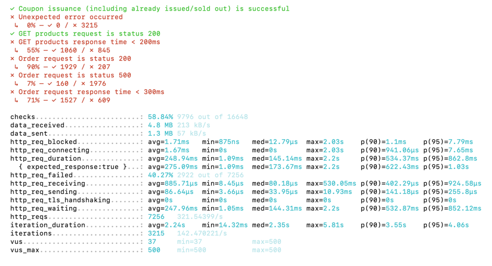

# 부하 테스트 보고서

## 1. 부하 테스트 대상 선정 및 목적
해당 부하 테스트는 실제 고객의 행동 패턴을 고려해 "쿠폰 발급 -> 상품 조회 -> 주문/결제" 프로세스가   
높은 트래픽 상황에서도 정상적으로 동작하는지 검증하는 하고자 합니다. 

* 쿠폰 발급 : 한정 수량의 쿠폰이 대량 요청 시 정상적으로 발급되는지, 동시 요청으로 인해 무결성이 깨지지 않는지 확인
* 상품 조회 : 사용자가 상품을 탐색하는 과정에서 시스템 부하가 과도하게 발생하는지 분석
* 주문/결제 : 주문~결제까지의 과정에서 DB 트랜잭션이 안정적으로 처리되는지 검증

## 2. 시나리오 설명
- 대량의 사용자가 쿠폰을 신청하고, 일부 사용자는 상품을 조회하며, 최종적으로 주문을 진행하는 시나리오를 구현
- 일정 시간 동안 트래픽이 점진적으로 증가하고 감소하는 부하 패턴을 적용하여 실제 서비스 환경을 모사

## 3. 테스트 스크립트
```javascript
import http from "k6/http";
import { check, sleep } from "k6";

export let options = {
    stages: [
        { duration: "5s", target: 300 },
        { duration: "5s", target: 500 },
        { duration: "5s", target: 400 },
        { duration: "5s", target: 200 },
    ],
};

export default function () {
    let url = "http://host.docker.internal:8080/api/v1/coupons";

    let userId = Math.floor(Math.random() * 3000) + 1;
    const couponId = 4;
    let productId = Math.floor(Math.random() * 16) + 1;
    let quantity = Math.floor(Math.random() * 5) + 1;
    const price = 10000;

    let payload = JSON.stringify({
        couponId: couponId,
        userId: userId,
    });

    let params = {
        headers: { "Content-Type": "application/json" },
    };

    // 쿠폰 발급 요청
    let res = http.post(url, payload, params);

    let isAlreadyIssued =
        res.status === 400 && res.body.includes("이미 발급된 쿠폰");
    let soldOut = res.status === 409 && res.body.includes("선착순 마감");
    let couponSuccess = res.status === 200 || isAlreadyIssued || soldOut;

    check(res, {
        "Coupon issuance (including already issued/sold out) is successful": (r) =>
            couponSuccess,
        "Unexpected error occurred": (r) => r.status >= 500,
    });

    if (res.status === 200) {
        userCoupons[userId] = couponId;
        console.log(`User ${userId} received Coupon ${couponId}`);
    } else {
        console.log(
            `Failed coupon issuance : User ${userId}, Response : ${res.body}`
        );
    }

    sleep(0.5);

    // 70% 확률로 조회
    if (Math.random() < 0.7) {
        let productRes = http.get(
            "http://host.docker.internal:8080/api/v1/products"
        );

        check(productRes, {
            "GET products request is status 200": (r) => r.status === 200,
            "GET products response time < 200ms": (r) => r.timings.duration < 200,
        });

        sleep(1);
    }

    // 80% 확률로 주문
    if (Math.random() < 0.8) {
        // 주문(결제) 요청
        let orderUrl = "http://host.docker.internal:8080/api/v1/orders";

        let orderPayload = {
            userId: userId,
            orderLines: [
                {
                    productId: productId,
                    quantity: quantity,
                    price: price,
                },
            ],
        };

        let orderRes = http.post(orderUrl, JSON.stringify(orderPayload), params);

        check(orderRes, {
            "Order request is status 200": (r) => r.status === 200,
            "Order request is status 500": (r) => r.status === 500,
            "Order request response time < 300ms": (r) => r.timings.duration < 300,
        });

        sleep(1);
    }
}
```

## 4. 결과

- **쿠폰 발급 성공률 100%**: 3215 요청 중 500건(제한 수량) 발급 (예상치 못한 에러 0건)
- **200ms 내 상품 조회 55%**: 응답 지연 문제 발생
- **주문 요청 성공률 90%**, 주문 응답 속도 300ms 초과율 29%
- **주문 요청 서버 오류(500) 발생률 7%**

## 5. 성능 지표 분석
(1) HTTP 요청 지연 시간 
- 평균 HTTP 응답 대기 시간 247.96ms, 90% 구간에서 532.87ms, 95% 구간에서 852.12ms 로 증가  
    -> 부하가 증가하면 성능이 급격하게 저하될 가능성
- 최대 응답 시간이 2.2초로, 일부 요청은 매우 오랜 시간 대기한 후 응답 받음  
    -> 특정 요청에서 병목 발생 가능성 높음

(2) HTTP 응답 시간
- 응답 시간이 200ms 이하인 요청이 적음
- 90% 구간에서 622.43ms, 95% 구간에서 1.03초로 급격히 증가  
    -> 부하가 증가할수록 성능이 악화됨

(3) 실패율 
- 전체 요청의 40.27% 실패 (400)


## 6. 시스템 병목 탐색
| 문제점 | 원인 |
|--------|-------------------|
| 상품 조회 응답 지연 | DB 부하, 캐싱 미적용 |
| 주문 요청 실패 | 동시 요청 증가로 인한 과부하 |
| 서버 500 오류 | 트랜잭션 오류, 리소스 부족 |

## 7. 성능 개선 방안

1. **상품 조회 성능 개선**
    - 캐싱 도입
    - DB 인덱싱 및 쿼리 최적화

3. **주문 요청 최적화**
    - Kafka 기반 비동기 처리
    - Connection Pool 확대

4. **서버 안정성 확보**
    - 장애 발생 시 자동 재시도 로직 적용
    - 모니터링 및 알람 시스템 강화

## 8. (가상) 장애 대응 계획
- **장애 유형 1: DB 과부하로 인한 성능 저하**
    - 대응: 캐싱 도입 및 쿼리 최적화

- **장애 유형 2: 서버 리소스 부족으로 인한 500 오류 증가**
    - 대응: Auto Scaling 적용 및 서버 확장

- **장애 유형 3: 주문 실패율 증가**
    - 대응: 메시지 큐(Kafka) 기반 비동기 처리 도입


